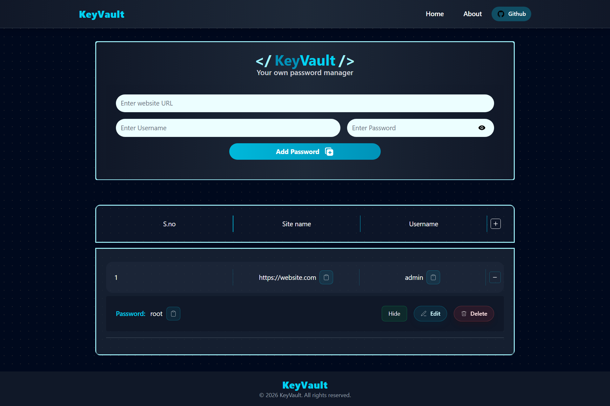

# Password Manager — Local Storage Variant


A focused client-side password manager demo built with React + Vite. This repository implements a small credential manager that demonstrates common UI patterns (create, read, update, delete), search/filter, notifications, and simple persistence using the browser `localStorage`.

Important: this app is for learning/demonstration only. Do NOT store real passwords or sensitive credentials here — data is stored in plain text in the browser.

---

## Highlights & Features

- Add, edit, and delete credential entries with fields: title, username, password, and optional notes.
- Search and filter entries by title or username.
- Persistent client-side storage via `localStorage` so entries survive page reloads on the same browser/device.
- Notifications using `react-toastify` for successful saves, updates and deletions.
- Unique IDs for records via `uuid` to ensure stable updates and removals.
- Small, component-driven React codebase compatible with Vite's fast dev server.

## Tech Stack

- React 19
- Vite
- Tailwind CSS (styling dependency)
- react-toastify (notifications)
- uuid (ID generation)

Exact versions are defined in `package.json`.

## Run the App (Quick Start)

Requirements: Node.js (recommend v16+)

```bash
npm install
npm run dev
```

Open the local URL printed by Vite (typically `http://localhost:5173`).

Available scripts (in `package.json`): `dev`, `build`, `preview`, `lint`.

## Project Structure

- [index.html](index.html)
- [package.json](package.json)
- [vite.config.js](vite.config.js)
- [src/main.jsx](src/main.jsx)
- [src/App.jsx](src/App.jsx)
- [src/index.css](src/index.css)
- [src/assets](src/assets)
- [src/components/Navbar.jsx](src/components/Navbar.jsx)
- [src/components/Manager.jsx](src/components/Manager.jsx)
- [src/components/Footer.jsx](src/components/Footer.jsx)

Key implementation notes:

- The main application logic (CRUD, localStorage persistence, search) lives in `src/components/Manager.jsx`.
- `Navbar.jsx` contains the top bar and global actions.

## How It Works (Data Flow)

- On load, the app reads stored entries from `localStorage` and hydrates React state.
- Creating or updating an entry updates state and writes the serialized entries back to `localStorage`.
- Deleting removes the entry from state and updates `localStorage`.
- The UI uses unique IDs (from `uuid`) so edits target the correct entry.

Local storage notes:

- The storage key is defined in the source; search the codebase for the exact string (commonly `passwords` or `entries`).
- To clear data manually: open DevTools → Application → Local Storage → remove the app key.

## Security & Limitations

- Data is stored in plain text in the browser — NOT secure.
- No authentication or encryption is provided.
- Not suitable for production or real credential storage.

If you need a production-ready solution, consider:

- Client-side encryption with a master password (AES) before writing to storage.
- Moving storage to a secure backend with authentication and encrypted-at-rest data.

## Troubleshooting

- If the dev server doesn't start, ensure Node.js is installed and run `npm install` again.
- Use `npm run lint` to surface style issues flagged by ESLint.

## Future Improvements

- Add optional client-side encryption with a master password.
- Replace `localStorage` with an authenticated backend API and database.
- Add unit and integration tests and a CI pipeline.

---

If you'd like, I can add a screenshot to `public/screenshot.png` and insert it here, or keep the README text-only. Let me know which you prefer.
